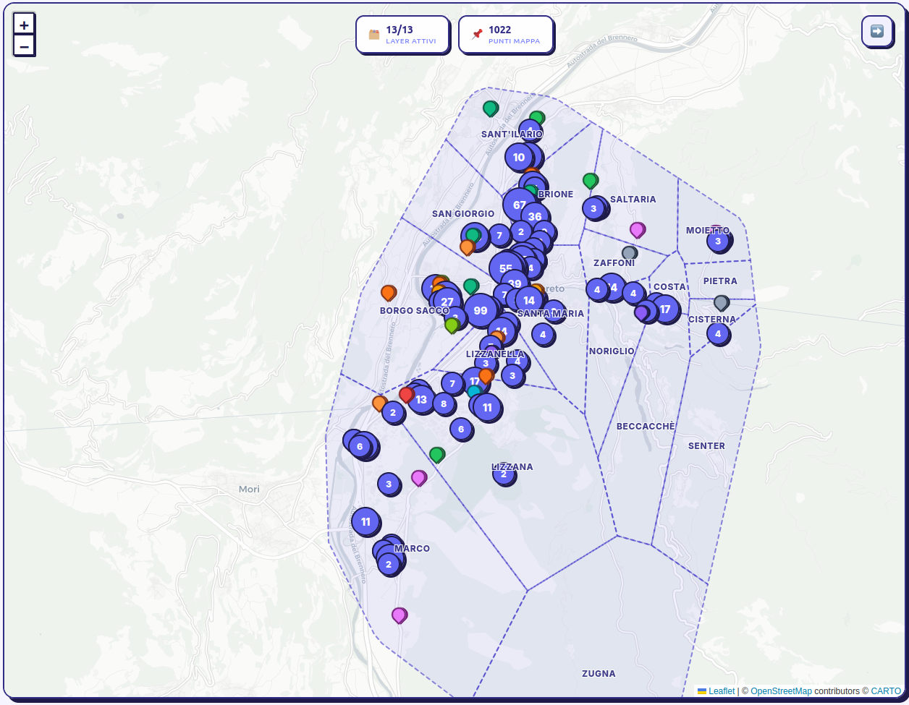
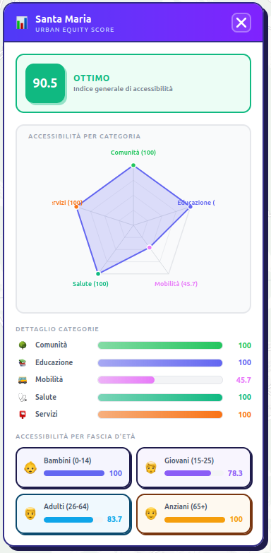
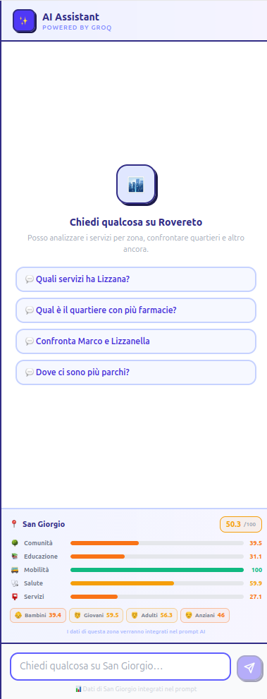
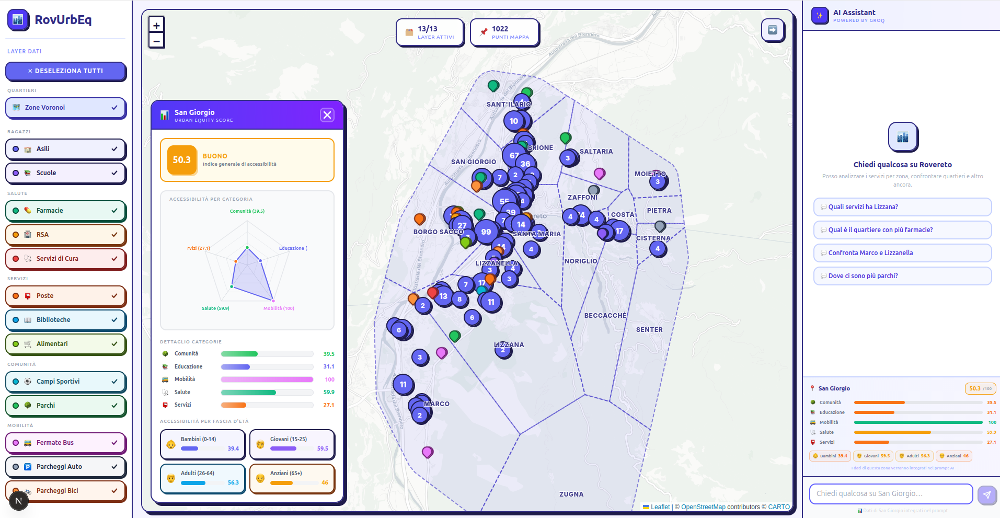

# RovUrbEQ

 

Benvenuti nel repository di **RovUrbEQ** (Rovereto Urban Equity Digital Twin)! 🎉 

Questo progetto è stato sviluppato durante il **Campionato Universitario AI (CUniAI)**. In sole **7 ore** di intenso lavoro, hack, design di logiche geografiche e problem solving, il nostro team è riuscito ad aggiudicarsi il **3° posto**! 🥉

## 🚀 Live Deployment

> [**Prova l'applicazione live qui!**](https://rovurbeq.vercel.app/)

---

## 📸 Screenshot dell'Applicazione

| Mappa Interattiva | Analisi ed Equità |
|:---:|:---:|
|  |  |

| AI Chat | Overall App
|:---:|:---: |
|  |  

---

## 🛠️ Tecnologie Utilizzate

L'applicazione è stata concepita con un focus sull'efficienza e le prestazioni, adottando uno stack JavaScript/TypeScript completamente moderno:

### **Frontend**
- **[Next.js](https://nextjs.org/)** (App Router)
- **[React 19](https://react.dev/)**
- **[Tailwind CSS](https://tailwindcss.com/)** per la stilizzazione rapida
- **[React Leaflet](https://react-leaflet.js.org/)** e **Leaflet** per il rendering mappe interattive

### **Backend & Database**
- **Next.js API Routes**
- **[MongoDB](https://www.mongodb.com/)** (interfacciato con **[Mongoose](https://mongoosejs.com/)**) come database principale per modelli geospaziali e di dati.

### **Geospatial Processing**
- **[Turf.js](https://turfjs.org/)** (`@turf/turf`) per l'analisi e le potenti computazioni geospaziali (intersezioni, calcoli su buffer, ecc.).

---

## 🌟 Funzionalità Principali

- **Analisi dell'Equità Urbana**: visualizzazione tramite grafici (radar chart) delle statistiche per singola zona/quartiere.
- **Mappa Interattiva & Geo-layering**: un'interfaccia utente basata su mappa geografica (Leaflet) dove navigare esplorando i dati demografici, servizi, della mobilità, ecc.
- **AI Chat Assistant**: un chatbot di supporto, in grado di aiutare e discutere i dati presenti nella mappa.
- **Integrazione Dati Complessi**: gestione di dati frammentati su Servizi Sanitari, Comunità, Ragazzi, Mobilità analizzati e interpolati (anche grazie agli algoritmi basati su Turf.js).

---

## 👥 Team

- **[Ali Raja Faizan](https://github.com/FA-05)**
- **[Caria Antonio](https://github.com/antoniocariaa)**
- **[Pedron Federico](https://github.com/federicopedron05)**

---
*Creato con 💡 e ☕ per il CUniAI Hackathon.*
