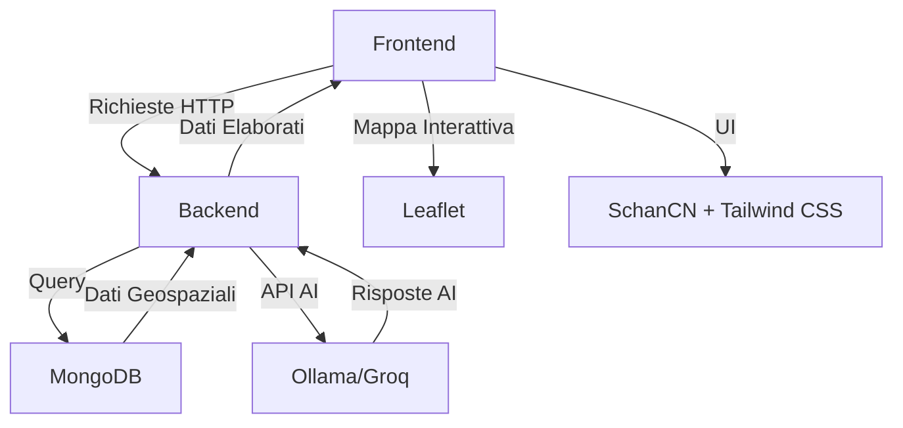

# **Urban Equity – Requisiti Non Funzionali & Architettura MVC**

*Ottimizzazione dei Servizi di Prossimità per il Comune di Rovereto*

---

## **📌 Indice**

1. [Panoramica del Progetto](#panoramica-del-progetto)
2. [Architettura Generale](#architettura-generale)
3. [Pattern MVC](#pattern-mvc)
4. [Requisiti Non Funzionali](#requisiti-non-funzionali)
  - [Backend](#backend)
  - [Frontend](#frontend)
  - [Database](#database)
  - [AI & Servizi Esterni](#ai--servizi-esterni)
  - [Sicurezza](#sicurezza)
  - [Prestazioni](#prestazioni)
  - [Manutenibilità & Scalabilità](#manutenibilità--scalabilità)
  - [Accessibilità](#accessibilità)
5. [Stack Tecnologico](#stack-tecnologico)
6. [Struttura del Progetto (Claude Code)](#struttura-del-progetto-claude-code)
7. [Esempio di Configurazione](#esempio-di-configurazione)

---

## **🏙️ Panoramica del Progetto**

**Urban Equity** è un sistema digitale per:

- **Mappare** l’offerta di servizi sociali (asili, centri anziani, uffici postali, ecc.) sulle circoscrizioni di Rovereto.
- **Calcolare** un **Indice di Accessibilità** (1-100) per ogni area, basato su:
  - Densità demografica.
  - Distanza media dai servizi.
  - Tipologia di servizio (priorità per fasce deboli: anziani, minori, studenti).
- **Assistere i cittadini** tramite un **chatbot/voicebot AI** che:
  - Riconosce il profilo utente (anziano, studente, genitore).
  - Restituisce servizi vicini in tempo reale (es. "ufficio postale più vicino" o "aula studio aperta ora").
- **Supportare la PA** nell’identificare **"deserti di servizi"** per pianificare investimenti.

---

## **🏗️ Architettura Generale**

L’architettura segue il **pattern MVC (Model-View-Controller)** con separazione netta tra:

- **Frontend** (React + Next.js) → **View** + **Controller (client-side)**.
- **Backend** (Next.js API Routes) → **Controller (server-side)** + **Model**.
- **Database** (MongoDB) → **Model (persistenza)**.
- **Servizi AI** (Ollama/Groq) → **Model (elaborazione)**.



---

## **🔄 Pattern MVC**

### **1. Model (Dati & Business Logic)**

- **Responsabilità**: Gestione dati, regole di business, accesso al DB e servizi esterni.
- **Componenti**:

  | Componente                    | Descrizione                                                       | Tecnologia                      |
  | ----------------------------- | ----------------------------------------------------------------- | ------------------------------- |
  | **Schemi MongoDB**            | Definizione collezioni (es. `services`, `demographics`, `users`). | MongoDB + Mongoose              |
  | **Servizi di Business Logic** | Calcolo Indice di Accessibilità, geolocalizzazione.               | TypeScript (Classi/Servizi)     |
  | **API Esterne**               | Integrazione con Ollama/Groq per l’AI.                            | `fetch` + SDK Ollama            |
  | **Geocoding**                 | Conversione indirizzi → coordinate (lat/long).                    | Nominatim OSM / Google Maps API |

- **Esempio di Model (TypeScript):**
  ```typescript
  // models/Service.ts
  export interface Service {
    _id: string;
    name: string;
    type: 'asilo' | 'centro_anziani' | 'ufficio_postale' | 'studentato' | 'farmacia';
    location: { lat: number; lng: number };
    address: string;
    openingHours?: string;
    capacity?: number; // Per asili/studentati
    accessibilityScore?: number; // Calcolato dinamicamente
  }

  // models/Demographic.ts
  export interface Demographic {
    _id: string;
    district: string; // Circoscrizione
    population: number;
    ageGroups: { [key: string]: number }; // es. { '0-5': 500, '65+': 1200 }
    density: number; // Abitanti/km²
  }
  ```

### **2. View (Interfaccia Utente)**

- **Responsabilità**: Rendering della UI, interazione con l’utente.
- **Componenti**:

  | Componente            | Descrizione                                                | Tecnologia              |
  | --------------------- | ---------------------------------------------------------- | ----------------------- |
  | **Mappa Interattiva** | Visualizzazione servizi + calcolo Indice di Accessibilità. | Leaflet + React-Leaflet |
  | **Chatbot**           | Interfaccia conversazionale (testo/voce).                  | React + Web Speech API  |
  | **Dashboard PA**      | Pannello per visualizzare "deserti di servizi".            | SchanCN + Tailwind CSS  |
  | **Filtri & Ricerca**  | Filtra servizi per tipo (asili, farmacie, ecc.).           | React Hooks             |

- **Esempio di View (React):**
  ```tsx
  // components/InteractiveMap.tsx
  import { MapContainer, TileLayer, Marker, Popup } from 'react-leaflet';
  import L from 'leaflet';

  export const InteractiveMap = ({ services }: { services: Service[] }) => {
    return (
      <MapContainer center={[45.8928, 11.0186]} zoom={13} style={{ height: '100vh' }}>
        <TileLayer url="https://{s}.tile.openstreetmap.org/{z}/{x}/{y}.png" />
        {services.map((service) => (
          <Marker
            key={service._id}
            position={[service.location.lat, service.location.lng]}
            icon={getIcon(service.type)}
          >
            <Popup>
              <h3>{service.name}</h3>
              <p>Indice Accessibilità: {service.accessibilityScore || 'N/D'}</p>
            </Popup>
          </Marker>
        ))}
      </MapContainer>
    );
  };
  ```

### **3. Controller (Gestione Flusso)**

- **Responsabilità**: Ricevere input, elaborare richieste, restituire risposte.
- **Componenti**:

  | Componente               | Descrizione                                         | Tecnologia              |
  | ------------------------ | --------------------------------------------------- | ----------------------- |
  | **API Routes (Next.js)** | Endpoint REST per CRUD servizi, calcolo indice, AI. | Next.js API Routes      |
  | **Middleware**           | Autenticazione, validazione input.                  | Next.js Middleware      |
  | **Handler Chatbot**      | Elabora prompt utente e interroga DB/AI.            | TypeScript + Ollama SDK |

- **Esempio di Controller (API Route):**
  ```typescript
  // pages/api/services/nearby.ts
  import { NextApiRequest, NextApiResponse } from 'next';
  import { Service } from '@/models/Service';

  export default async function handler(req: NextApiRequest, res: NextApiResponse) {
    if (req.method !== 'GET') return res.status(405).end();

    const { lat, lng, type, maxDistance = 1000 } = req.query;
    
    // 1. Validazione input
    if (!lat || !lng) {
      return res.status(400).json({ error: 'Coordinate mancanti' });
    }

    // 2. Query al DB (Model)
    const nearbyServices = await Service.find({
      location: {
        $near: {
          $geometry: { type: 'Point', coordinates: [parseFloat(lng as string), parseFloat(lat as string)] },
          $maxDistance: parseInt(maxDistance as string),
        },
      },
      ...(type && { type }),
    });

    // 3. Calcolo Indice di Accessibilità (Business Logic)
    const servicesWithScore = nearbyServices.map(service => ({
      ...service.toObject(),
      accessibilityScore: calculateAccessibilityScore(service, parseFloat(lat as string), parseFloat(lng as string)),
    }));

    // 4. Risposta (View)
    res.status(200).json(servicesWithScore);
  }
  ```

---

## **⚙️ Requisiti Non Funzionali**

### **🖥️ Backend**


| Requisito        | Descrizione                                    | Implementazione                    |
| ---------------- | ---------------------------------------------- | ---------------------------------- |
| **Linguaggio**   | TypeScript per tipizzazione statica.           | `tsconfig.json` con `strict: true` |
| **Framework**    | Next.js (App Router) per SSR/SSG e API Routes. | `next.config.js`                   |
| **Architettura** | **Clean Architecture** con separazione in:     | &nbsp;                             |


- `models/` (Schemi DB)
- `services/` (Business Logic)
- `controllers/` (API Handlers)
- `lib/` (Utility, es. geocoding) | Struttura cartelle |  
| **API Design** | RESTful + GraphQL (opzionale per query complesse). | REST: `/api/services`, `/api/demographics` |  
| **Autenticazione** | JWT per accesso PA, OAuth 2.0 per cittadini (opzionale). | `next-auth` + MongoDB |  
| **Rate Limiting** | Limite richieste per evitare abusi (es. 100 req/min per IP). | `upstash/ratelimit` |  
| **Logging** | Tracciamento errori e performance. | `pino` o `winston` |  
| **Caching** | Cache risposte API (es. dati demografici statici). | `redis` + `next/cache` |  
| **Environment** | Variabili d’ambiente per configurazioni sensibili. | `.env.local` + `dotenv` |

### **🎨 Frontend**


| Requisito           | Descrizione                                                 | Implementazione                          |
| ------------------- | ----------------------------------------------------------- | ---------------------------------------- |
| **Framework**       | Next.js (App Router) per rendering lato client/server.      | `app/` directory                         |
| **Stile**           | **SchanCN** (Componenti UI) + **Tailwind CSS** per styling. | `tailwind.config.js` + `@/components/ui` |
| **Mappa**           | Leaflet per visualizzazione geospaziale.                    | `react-leaflet`                          |
| **Stato Globale**   | Gestione stato con **Zustand** o **Redux Toolkit**.         | `zustand` (più leggero)                  |
| **Responsività**    | Design adattivo per mobile/desktop.                         | Tailwind `sm:`, `md:`, `lg:`             |
| **Accessibilità**   | WCAG 2.1 AA (contrasto, ARIA labels, tastiera).             | `eslint-plugin-jsx-a11y`                 |
| **Localizzazione**  | Supporto italiano/inglese (i18n).                           | `next-intl`                              |
| **Performance**     | Lazy loading componenti pesanti (es. mappa).                | `next/dynamic`                           |
| **Offline Support** | Cache dati per utilizzo offline (PWA).                      | `workbox` + Service Worker               |


### **🗃️ Database (MongoDB)**


| Requisito         | Descrizione                                              | Implementazione                                 |
| ----------------- | -------------------------------------------------------- | ----------------------------------------------- |
| **Schema Design** | Collezioni normalizzate con riferimenti.                 | Mongoose ODM                                    |
| **Indici**        | Indici geospaziali (`2dsphere`) per query di prossimità. | `serviceSchema.index({ location: '2dsphere' })` |
| **Backup**        | Backup automatici quotidiani.                            | MongoDB Atlas / `mongodump`                     |
| **Replica Set**   | Alta disponibilità con replica set.                      | MongoDB Atlas (3 nodi)                          |
| **Sharding**      | Partizionamento per scalabilità orizzontale.             | Sharding per `district`                         |
| **Validazione**   | Validazione dati lato DB.                                | Mongoose `required: true`, `enum`               |


- **Esempio Schema MongoDB:**
  ```typescript
  // schemas/ServiceSchema.ts
  import { Schema, model } from 'mongoose';

  const ServiceSchema = new Schema({
    name: { type: String, required: true },
    type: {
      type: String,
      enum: ['asilo', 'centro_anziani', 'ufficio_postale', 'studentato', 'farmacia', 'biblioteca'],
      required: true,
    },
    location: {
      type: { type: String, enum: ['Point'], required: true },
      coordinates: { type: [Number], required: true }, // [longitudine, latitudine]
    },
    address: { type: String, required: true },
    district: { type: String, required: true }, // Circoscrizione
    openingHours: { type: String },
    capacity: { type: Number },
    metadata: { type: Schema.Types.Mixed }, // Dati aggiuntivi (es. accessibilità disabili)
  });

  ServiceSchema.index({ location: '2dsphere' }); // Indice geospaziale
  ServiceSchema.index({ type: 1 }); // Indice per filtro tipo
  ServiceSchema.index({ district: 1 }); // Indice per circoscrizione

  export const Service = model('Service', ServiceSchema);
  ```

### **🤖 AI & Servizi Esterni**


| Requisito              | Descrizione                             | Implementazione         |
| ---------------------- | --------------------------------------- | ----------------------- |
| **Modello AI**         | Ollama (locale) o Groq (cloud) per LLM. | `ollama` CLI / Groq API |
| **Prompt Engineering** | Prompt ottimizzati per:                 | &nbsp;                  |


- Classificazione profilo utente.
- Generazione risposte in italiano.
- Filtro servizi pertinenti. | Template prompt in `/prompts/` |  
| **Geocoding** | Conversione indirizzi → coordinate. | Nominatim OSM (gratis) o Google Maps API |  
| **API OSM** | Query Overpass per dati aggiornati. | `overpass-api` npm |  
| **Fallback** | Gestione errori AI (es. timeout, risposta non valida). | Retry + messaggio di default |
- **Esempio Integrazione Ollama:**
  ```typescript
  // lib/ai.ts
  import { Ollama } from 'ollama';

  const ollama = new Ollama({ host: 'http://localhost:11434' });

  export async function getAIResponse(prompt: string, userProfile?: string) {
    const systemPrompt = `
      Sei un assistente virtuale per il Comune di Rovereto.
      ${userProfile ? `L'utente è un ${userProfile}.` : ''}
      Rispondi in italiano, fornendo solo informazioni sui servizi di prossimità (asili, centri anziani, uffici postali, ecc.).
      Se non conosci la risposta, di' "Mi dispiace, non ho questa informazione."
    `;

    const response = await ollama.generate({
      model: 'llama3.2:3b',
      prompt: `[INST] ${systemPrompt} [/INST] ${prompt}`,
      stream: false,
    });

    return response.response;
  }
  ```

### **🔒 Sicurezza**


| Requisito                | Descrizione                            | Implementazione                 |
| ------------------------ | -------------------------------------- | ------------------------------- |
| **HTTPS**                | Connessione sicura.                    | Certificato SSL (Let’s Encrypt) |
| **CORS**                 | Restrizione origini per API.           | `next.config.js`                |
| **Sanitizzazione Input** | Prevenzione SQL Injection / XSS.       | `zod` per validazione           |
| **Autenticazione**       | JWT con scadenza (1h) e refresh token. | `jsonwebtoken` + `jose`         |
| **Ruoli**                | Differenziazione tra:                  | &nbsp;                          |


- **Cittadino** (solo lettura).
- **PA** (scrittura dati, dashboard).
- **Admin** (gestione utenti). | Middleware Next.js |  
| **Rate Limiting** | Protezione da attacchi DDoS. | `upstash/ratelimit` |  
| **Audit Log** | Tracciamento azioni sensibili (es. modifica dati). | MongoDB collection `auditLogs` |
- **Esempio Validazione Input con Zod:**
  ```typescript
  // schemas/serviceSchema.ts
  import { z } from 'zod';

  export const ServiceSchema = z.object({
    name: z.string().min(1),
    type: z.enum(['asilo', 'centro_anziani', 'ufficio_postale', 'studentato', 'farmacia']),
    location: z.object({
      lat: z.number().min(-90).max(90),
      lng: z.number().min(-180).max(180),
    }),
    address: z.string().min(1),
    district: z.string().min(1),
  });

  export type ServiceInput = z.infer<typeof ServiceSchema>;
  ```

### **⚡ Prestazioni**


| Requisito             | Descrizione                                                | Implementazione              |
| --------------------- | ---------------------------------------------------------- | ---------------------------- |
| **Tempo di Risposta** | < 500ms per API, < 2s per calcolo Indice di Accessibilità. | Ottimizzazione query MongoDB |
| **Caching**           | Cache dati statici (es. demografia) per 24h.               | `redis`                      |
| **Compressione**      | Gzip/Brotli per risorse statiche.                          | Next.js built-in             |
| **Lazy Loading**      | Caricamento dinamico componenti pesanti.                   | `next/dynamic`               |
| **CDN**               | Distribuzione risorse statiche.                            | Vercel CDN                   |
| **Database**          | Query ottimizzate con indici e proiezioni.                 | MongoDB `explain()`          |


- **Esempio Caching con Redis:**
  ```typescript
  // lib/cache.ts
  import { Redis } from '@upstash/redis';

  const redis = new Redis({
    url: process.env.REDIS_URL!,
    token: process.env.REDIS_TOKEN!,
  });

  export async function getCachedDemographics(district: string) {
    const cacheKey = `demographics:${district}`;
    const cached = await redis.get(cacheKey);
    if (cached) return JSON.parse(cached);

    const data = await Demographic.findOne({ district });
    await redis.set(cacheKey, JSON.stringify(data), { ex: 86400 }); // 24h
    return data;
  }
  ```

### **📈 Manutenibilità & Scalabilità**


| Requisito          | Descrizione                                                | Implementazione                  |
| ------------------ | ---------------------------------------------------------- | -------------------------------- |
| **Modularità**     | Componenti riutilizzabili (es. `MapComponent`, `Chatbot`). | React Components                 |
| **Documentazione** | Doc API con Swagger/OpenAPI.                               | `swagger-ui` + `@nestjs/swagger` |
| **Testing**        | Copertura > 80%:                                           | &nbsp;                           |


- Unit test (Jest).
- Integration test (Supertest).
- E2E test (Cypress). | `jest`, `supertest`, `cypress` |  
| **CI/CD** | Deploy automatico su push a `main`. | GitHub Actions |  
| **Monitoraggio** | Metriche performance e errori. | `Sentry` + `Prometheus` |  
| **Scalabilità Orizzontale** | Containerizzazione per scaling. | Docker + Kubernetes |
- **Esempio Dockerfile:**
  ```dockerfile
  # Dockerfile
  FROM node:18-alpine AS base
  WORKDIR /app

  FROM base AS deps
  COPY package.json yarn.lock* package-lock.json* pnpm-lock.yaml* ./
  RUN npm install

  FROM base AS builder
  COPY --from=deps /app/node_modules ./node_modules
  COPY . .
  RUN npm run build

  FROM base AS runner
  COPY --from=builder /app/public ./public
  COPY --from=builder /app/.next ./.next
  COPY --from=builder /app/node_modules ./node_modules
  COPY --from=builder /app/package.json ./package.json
  EXPOSE 3000
  CMD ["npm", "start"]
  ```

### **♿ Accessibilità**


| Requisito             | Descrizione                              | Implementazione                         |
| --------------------- | ---------------------------------------- | --------------------------------------- |
| **WCAG 2.1 AA**       | Conformità agli standard internazionali. | `axe-core`                              |
| **Contrasto**         | Rapporto minimo 4.5:1 per testo.         | Tailwind `text-gray-800` su `bg-white`  |
| **Tastiera**          | Navigazione completa tramite tastiera.   | `tabIndex`, `onKeyDown`                 |
| **Screen Reader**     | Supporto per lettori schermo.            | ARIA labels (`aria-label`, `aria-live`) |
| **Testo Alternativo** | Descrizioni per immagini/mappe.          | `alt` text, `title` Leaflet             |
| **Multilingua**       | Supporto italiano e inglese.             | `next-intl`                             |
| **Voice UI**          | Interfaccia vocale per anziani.          | Web Speech API                          |


- **Esempio ARIA in React:**
  ```tsx
  // components/AccessibleButton.tsx
  export const AccessibleButton = ({ children, onClick }: { children: React.ReactNode; onClick: () => void }) => {
    return (
      <button
        onClick={onClick}
        onKeyDown={(e) => e.key === 'Enter' && onClick()}
        aria-label={`Premi Invio per ${typeof children === 'string' ? children : 'confermare'}`}
        className="focus:outline-none focus:ring-2 focus:ring-blue-500"
      >
        {children}
      </button>
    );
  };
  ```

---

## **🛠️ Stack Tecnologico**


| Categoria          | Tecnologia         | Versione | Note                         |
| ------------------ | ------------------ | -------- | ---------------------------- |
| **Frontend**       | Next.js            | 14.x     | App Router                   |
| **Linguaggio**     | TypeScript         | 5.x      | `strict: true`               |
| **Stile**          | Tailwind CSS       | 3.x      | + SchanCN                    |
| **Mappa**          | Leaflet            | 1.9.x    | + React-Leaflet              |
| **Stato Globale**  | Zustand            | 4.x      | Alternativa: Redux Toolkit   |
| **Backend**        | Next.js API Routes | 14.x     | REST + WebSocket (opzionale) |
| **Database**       | MongoDB            | 6.x      | Atlas (Cloud) o Self-Hosted  |
| **ODM**            | Mongoose           | 8.x      | Schema validation            |
| **AI**             | Ollama / Groq      | Latest   | LLM locali/cloud             |
| **Geocoding**      | Nominatim OSM      | -        | Gratis                       |
| **Autenticazione** | NextAuth.js        | 5.x      | JWT + OAuth                  |
| **Cache**          | Redis              | 7.x      | Upstash (Serverless)         |
| **Testing**        | Jest + Cypress     | Latest   | Unit + E2E                   |
| **CI/CD**          | GitHub Actions     | -        | Deploy su Vercel             |
| **Monitoraggio**   | Sentry             | -        | Error tracking               |
| **Container**      | Docker             | 24.x     | + Kubernetes                 |


---

## **📁 Struttura del Progetto (Claude Code)**

```bash
urban-equity/
├── .github/
│   └── workflows/
│       ├── ci.yml          # GitHub Actions CI
│       └── cd.yml          # GitHub Actions CD
├── public/
│   ├── images/             # Risorse statiche
│   └── favicon.ico
├── src/
│   ├── app/                # Next.js App Router
│   │   ├── (auth)/         # Pagine autenticazione
│   │   │   ├── login/
│   │   │   └── register/
│   │   ├── (dashboard)/    # Pannello PA
│   │   │   └── analytics/
│   │   ├── (map)/          # Mappa interattiva
│   │   │   └── page.tsx
│   │   ├── (chatbot)/      # Assistente virtuale
│   │   │   └── page.tsx
│   │   ├── api/            # API Routes
│   │   │   ├── services/
│   │   │   │   ├── nearby/route.ts
│   │   │   │   └── [...id]/route.ts
│   │   │   ├── demographics/
│   │   │   │   └── route.ts
│   │   │   └── ai/
│   │   │       └── chat/route.ts
│   │   ├── layout.tsx
│   │   └── page.tsx
│   ├── components/
│   │   ├── ui/             # SchanCN Components
│   │   │   ├── button.tsx
│   │   │   └── card.tsx
│   │   ├── InteractiveMap.tsx
│   │   ├── Chatbot.tsx
│   │   ├── ServiceCard.tsx
│   │   └── AccessibilityScore.tsx
│   ├── lib/
│   │   ├── db.ts           # Connessione MongoDB
│   │   ├── ai.ts           # Integrazione Ollama/Groq
│   │   ├── geocoding.ts    # Conversione indirizzi → coordinate
│   │   ├── cache.ts        # Redis cache
│   │   └── utils.ts        # Funzioni utility
│   ├── models/
│   │   ├── Service.ts      # Schema Service
│   │   ├── Demographic.ts  # Schema Dati Demografici
│   │   └── User.ts         # Schema Utente
│   ├── schemas/
│   │   └── serviceSchema.ts # Validazione Zod
│   ├── services/
│   │   ├── accessibilityService.ts # Calcolo Indice
│   │   ├── serviceService.ts       # CRUD Servizi
│   │   └── demographicService.ts   # CRUD Dati Demografici
│   ├── prompts/
│   │   ├── chatbotPrompt.ts # Template prompt AI
│   │   └── classificationPrompt.ts # Classificazione profilo
│   ├── styles/
│   │   └── globals.css     # Tailwind CSS
│   ├── types/
│   │   └── index.ts        # Tipi TypeScript globali
│   └── middleware.ts       # Autenticazione Middleware
├── .env.local              # Variabili ambiente
├── .env.example            # Template variabili
├── next.config.js          # Configurazione Next.js
├── tailwind.config.js      # Configurazione Tailwind
├── tsconfig.json           # Configurazione TypeScript
├── package.json
├── Dockerfile              # Containerizzazione
├── docker-compose.yml      # Servizi (MongoDB, Redis)
└── README.md               # Documentazione
```

---

## **⚙️ Esempio di Configurazione**

### **1. `package.json**`

```json
{
  "name": "urban-equity",
  "version": "1.0.0",
  "private": true,
  "scripts": {
    "dev": "next dev",
    "build": "next build",
    "start": "next start",
    "lint": "next lint",
    "test": "jest",
    "test:e2e": "cypress open"
  },
  "dependencies": {
    "next": "^14.0.0",
    "react": "^18.2.0",
    "react-dom": "^18.2.0",
    "typescript": "^5.0.0",
    "mongoose": "^8.0.0",
    "leaflet": "^1.9.4",
    "react-leaflet": "^4.2.1",
    "@upstash/redis": "^1.20.0",
    "next-auth": "^5.0.0-beta",
    "zod": "^3.22.0",
    "zustand": "^4.4.0",
    "tailwindcss": "^3.3.0",
    "@radix-ui/react-dropdown-menu": "^2.0.0",
    "@radix-ui/react-dialog": "^1.0.0",
    "ollama": "^0.1.0",
    "@google/genai": "^0.1.0", // Alternativa a Ollama
    "axios": "^1.6.0",
    "swr": "^2.2.0"
  },
  "devDependencies": {
    "@types/node": "^20.0.0",
    "@types/react": "^18.2.0",
    "@types/react-dom": "^18.2.0",
    "@types/leaflet": "^1.9.0",
    "autoprefixer": "^10.4.0",
    "postcss": "^8.4.0",
    "eslint": "^8.0.0",
    "eslint-config-next": "^14.0.0",
    "jest": "^29.0.0",
    "ts-jest": "^29.0.0",
    "@testing-library/react": "^14.0.0",
    "cypress": "^13.0.0",
    "@cypress/vision": "^3.0.0"
  }
}
```

### **2. `next.config.js**`

```javascript
/** @type {import('next').NextConfig} */
const nextConfig = {
  reactStrictMode: true,
  swcMinify: true,
  images: {
    domains: ['tile.openstreetmap.org'], // Per Leaflet
  },
  experimental: {
    serverActions: true, // Per Next.js 14
  },
  // Abilita compressione
  compress: true,
  // Imposta base path se deployato in sottocartella
  // basePath: '/urban-equity',
};

module.exports = nextConfig;
```

### **3. `tailwind.config.js**`

```javascript
/** @type {import('tailwindcss').Config} */
module.exports = {
  darkMode: ['class'],
  content: [
    './src/pages/**/*.{js,ts,jsx,tsx,mdx}',
    './src/components/**/*.{js,ts,jsx,tsx,mdx}',
    './src/app/**/*.{js,ts,jsx,tsx,mdx}',
  ],
  theme: {
    extend: {
      colors: {
        primary: {
          50: '#eff6ff',
          100: '#dbeafe',
          500: '#3b82f6',
          600: '#2563eb',
        },
      },
    },
  },
  plugins: [require('tailwindcss-animate')],
};
```

### **4. `.env.example**`

```bash
# MongoDB
MONGODB_URI=mongodb+srv://<user>:<password>@cluster0.example.mongodb.net/urban-equity?retryWrites=true&w=majority

# Redis (Upstash)
REDIS_URL=https://<id>.upstash.io
REDIS_TOKEN=<token>

# Ollama (Locale)
OLLAMA_HOST=http://localhost:11434

# Groq (Cloud)
GROQ_API_KEY=<api_key>

# NextAuth
NEXTAUTH_SECRET=<random_string>
NEXTAUTH_URL=http://localhost:3000

# Google Maps API (opzionale)
GOOGLE_MAPS_API_KEY=<api_key>

# Sentry
SENTRY_DSN=<dsn>
```

### **5. `docker-compose.yml**`

```yaml
version: '3.8'

services:
  app:
    build: .
    ports:
      - "3000:3000"
    environment:
      - MONGODB_URI=mongodb://mongo:27017/urban-equity
      - REDIS_URL=redis://redis:6379
    depends_on:
      - mongo
      - redis
    volumes:
      - .:/app
      - /app/node_modules

  mongo:
    image: mongo:6
    ports:
      - "27017:27017"
    environment:
      - MONGO_INITDB_ROOT_USERNAME=root
      - MONGO_INITDB_ROOT_PASSWORD=example
      - MONGO_INITDB_DATABASE=urban-equity
    volumes:
      - mongo-data:/data/db

  redis:
    image: redis:7
    ports:
      - "6379:6379"
    volumes:
      - redis-data:/data

  ollama:
    image: ollama/ollama:latest
    ports:
      - "11434:11434"
    volumes:
      - ollama-data:/root/.ollama
    # Pull modello all'avvio
    command: ["ollama", "pull", "llama3.2:3b"]

volumes:
  mongo-data:
  redis-data:
  ollama-data:
```

---

## **📌 Note Finali per Claude Code**

1. **Struttura Modulare**: Ogni componente (Mappa, Chatbot, Dashboard) è isolato in cartelle dedicate.
2. **TypeScript Strict**: Abilita `strict: true` in `tsconfig.json` per prevenire errori.
3. **API Routes**: Usa **Next.js API Routes** per il backend (nessun server esterno necessario).
4. **Geospaziale**: MongoDB supporta query geospaziali nativamente (`$near`, `$geoWithin`).
5. **AI Locale**: Ollama è ideale per sviluppo locale (nessun costo, privacy garantita).
6. **Deploy**: Vercel è la scelta ottimale per Next.js (supporto nativo per API Routes e SSR).
7. **Testing**: Includi test per:
  - Calcolo Indice di Accessibilità.
  - Query geospaziali.
  - Integrazione AI.

---

## **🚀 Prossimi Passi**

1. **Setup Iniziale**:
  ```bash
   npx create-next-app@latest urban-equity --typescript --tailwind --eslint --app --src-dir --import-alias "@/*"
   cd urban-equity
   npm install mongoose leaflet react-leaflet @upstash/redis zod zustand
  ```
2. **Configura MongoDB**:
  - Crea un cluster su [MongoDB Atlas](https://www.mongodb.com/atlas) o usa Docker locale.
3. **Aggiungi Dati**:
  - Popola `services` e `demographics` con i dati di Rovereto (es. da [Overpass Turbo](https://overpass-turbo.eu/) per OSM).
4. **Sviluppa il Calcolo dell’Indice**:
  - Implementa `calculateAccessibilityScore()` in `services/accessibilityService.ts`.
5. **Integra l’AI**:
  - Installa Ollama locale (`curl -fsSL https://ollama.com/install.sh | sh`) o usa Groq API.
6. **Testa la Mappa**:
  - Verifica che Leaflet visualizzi correttamente i marker.
7. **Deploy**:
  - Push su GitHub e configura Vercel per il deploy automatico.

---

> **⚠️ Importante**: Questo documento è **pronto per Claude Code**. Copia la struttura del progetto e i file di configurazione per iniziare lo sviluppo.